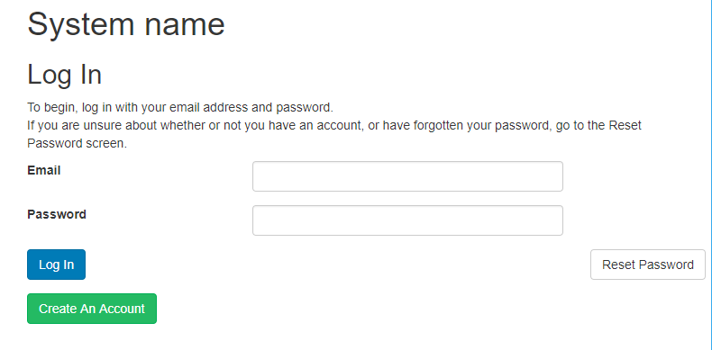
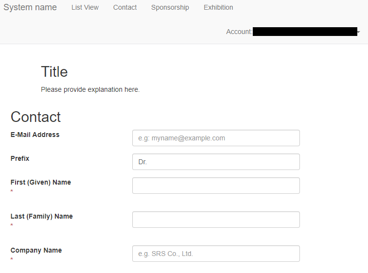

# Onlineform

## Overview

This project is for creating an online form. The contents can be arranged by uploading a csv format file. Typical use is for the conference registration system.

## Requirement

- PHP server

## Licence

[MIT](https://github.com/yoshimoto56/eit/blob/master/LICENSE)

## Author

[yoshimoto56](https://github.com/yoshimoto56)